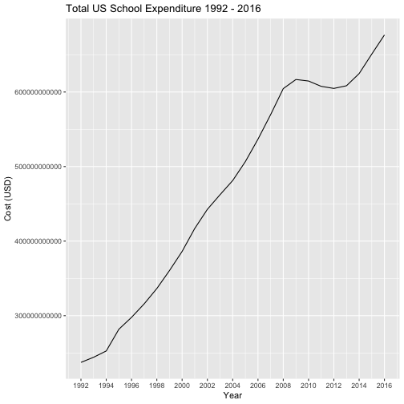

## Patterns and Insights

In our introduction, we mentioned how complicated the US school system is. Not only
is the system complicated, but the system covers and enormous range of students,
making it hard to make sweeping conclusions about the whole system. In our app, 
we had two graphs that charted the cost the US school system, and two that attempted
to look at disparities in the system by race and by gender.

### Cost conclusions

For our school system cost graphs, our conclusions were clear. The cost of the US
education system has risen significantly over the past twenty years. To demonstrate
this, we have charted the total expenditure of all schools over the past twenty years:

There are a lot of factors that go into this increase. Firstly, there has been a
lot of technology development over the last twenty years. Keeping up with this
certainly has a significant cost. Also, the increase in number of students definitely
plays a part in the increase in cost.

### Student Demographic Conclusions

Looking at our race and gender focused charts, drawing meaningful conclusions becomes
significantly harder. For discipline, students who identified as male were significantly
more likely to be suspended than their female counterparts. Also, black students had
the highest suspension rates, while asain students had the lowest. While these observations
are true, they don't really give too much insight into the system without further research.
Are these statistics the result of a broken system, or is there something else at play here?
The SAT and ACT statistics give similarly confusing results. Here the data actually gives
us less conclusions because the participation rates are very similar to the gender and
racial makeup of the states that the data is taken from. Therefore it is hard to really
say if schools have biases when preparing students for standardized testing.

## Data Quality

We feel like our data is of high quality. The data we got from Kaggle has its sources
listed, and the author has reasonable credentials. We have no reason to distrust
the data from Kaggle. The data from the Urban Institute was of high quality
because it is an official source, and they have no reason to put out fake or
misleading data. It seems like our results are unbiased, but it is not absolutely
impossible that some data is slightly biased. We do not see issues that potentially
harm certain groups with this data.

### Further Work

There are a few things that we could do to advance this project further. We are
pretty satisfied how the cost portion of this project turned out, but there is
certainly more to get done with the analysis of students by their characteristics.
Certainly, a good place to start would be adjusting the SAT / ACT participation rates
for the population make-up of each state. This would give more clear conclusions
from the analysis. The next steps would be to look into the reasons for any differences
in the statistics. This would likely involve a lot of research.

